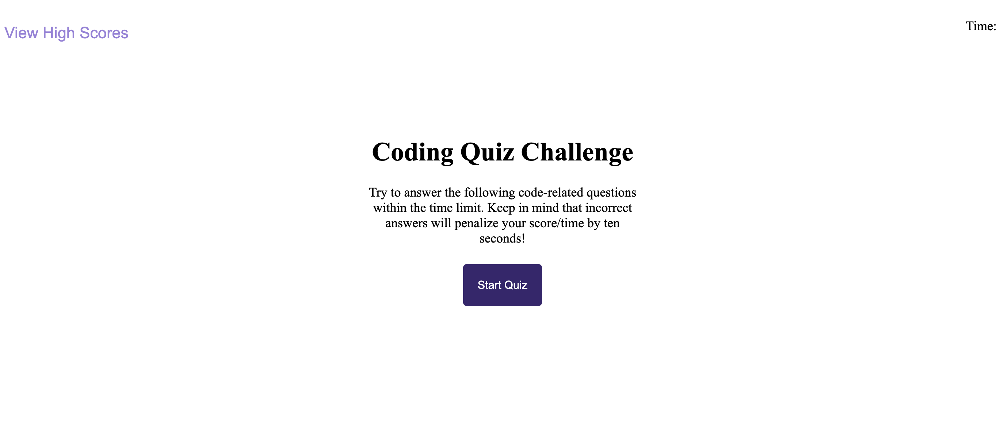
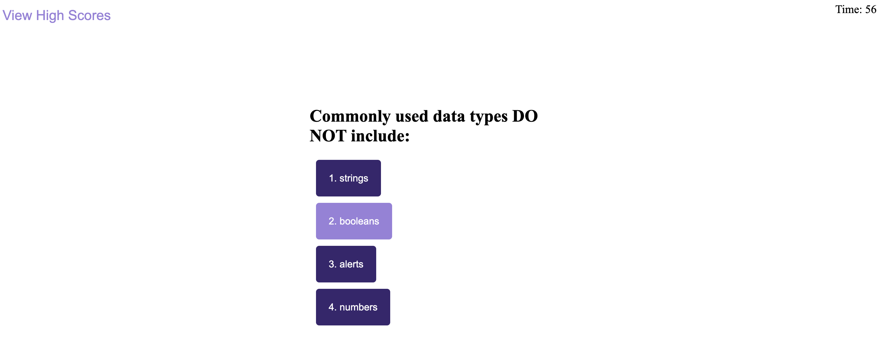
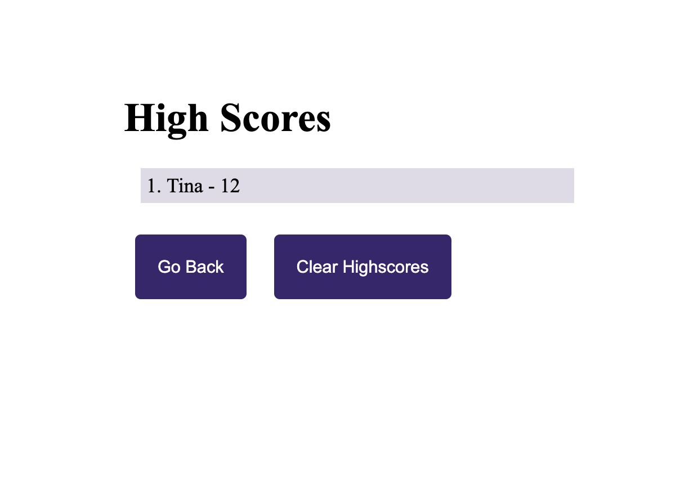

# w4_coding_quiz
# Coding Challenge: Timed Code Quiz
### Description
Build a timed coding quiz with multiple choice questions featuring dynamically updated HTML and CSS powered by JavaScript code. The quiz will run in browser with clean and responsive user interface.

## Deployed Page: [link](https://tunaabop.github.io/w4_codingquiz/index.html)

### This is what the page should look like when the quiz starts...

### and when a user answers a question...

### and to view highest score...

